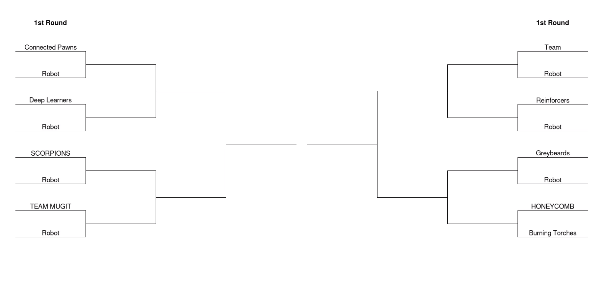

# Tic-Tac-Toe :o::x::x::x::o:

Tic-tac-toe (also known as noughts and crosses) is a classic open and paper game.


## Rules of Tic-Tac-Toe :o:

Both players attempt to play 3 of the their counter (`O` or `X`) in a row on a **3 x 3** grid, either vertically, horizontally or diagonally.


Your task is to write code that plays **Tic-Tac-Toe**.

You can play against google [here](https://g.co/kgs/5kTaipx)

## Human player

You will be playing against your own bot in this game! Just click on the board to take a move.

If you cannot see the board when you click run, click the "+" button next to the Console. Then open "VNC". You should see the board in this tab.

If you'd rather your bot played against a random opponent without the visuals, change the bottom line of main.py to this:

```python
play_wild_ttt_game(
     your_choose_move=choose_move,
     opponent_choose_move=choose_move_randomly,
     game_speed_multiplier=1,
     verbose=True,
     render=False,
 )
```

## Competition Rules :scroll:

-   You can only write code in the `choose_move` function in `main.py`.
   - In the competition, your agent will call the `choose_move()` function in `main.py` to select a move
   - Any code not in `main.py` **will not be used**.


## Technical Details :hammer:

### New concepts

There are a few new python concepts you will need for this exercise (and to understand the example in `choose_move()`). These are detailed in `python_concepts.md`

### The **`choose_move()`** Function

In the competition, the **`choose_move()`** function is called to make your next move.

**Inputs:**

1. The board - a flat list of numbers (0, 1 or -1). 1 is your counters, -1 is your opponents, 0 is empty. The grid below shows how the list index corresponds to locations on the board. E.g. top left corner is the first element of the list.

```
0 | 1 | 2
3 | 4 | 5
6 | 7 | 8
```

E.g. `[1, 0, 0, 1, 0, -1, 0, 0, -1]` represents:

```
O |   |
O |   | X
  |   | X
```

Do not worry about whether your are O or X. Just focus on the 1s and -1s.


### Example in your `choose_move` function

We have provided (commented out) example that moves randomly. This could be a good guide on how to start building your solution.


## Competition Format :crossed_swords:

The competition will consist of your AI playing other teams' AIs 1-v-1 in a knockout tournament fashion.

Since going first gives an advantage, each 1-v-1 matchup consists of a **pair of games**. Each player starts one of the 2 games. In the event of a tie, it will go to a **sudden-death duel** :skull: (tiebreaker games). These 'duels' will be pairs of games with 1 player starting each game.


